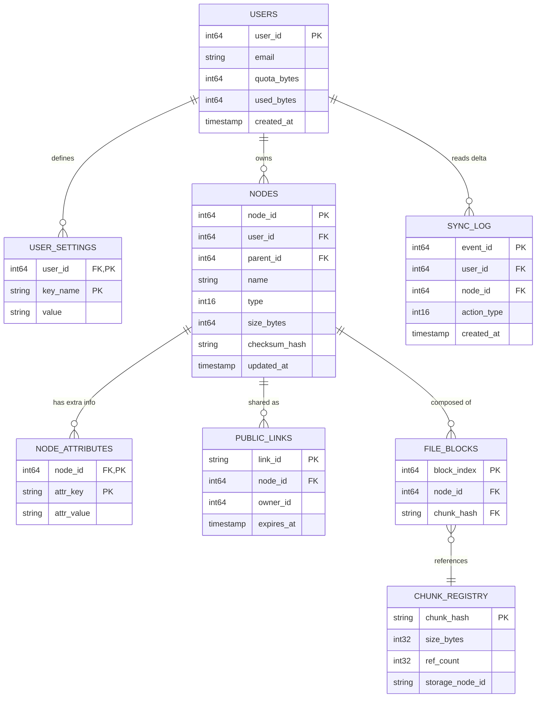

# Яндекс Диск

## 1. Тема, целевая аудитория и функционал

### 1.1 Тема и целевая аудитория

**Яндекс.Диск** - облачное файловое хранилище, входящее в экосистему Яндекс 360. Сервис ориентирован на доступность, скорость и простоту использования.

**Активность (оценка):**
*   **Месячная активная аудитория (MAU):** 93 млн пользователей. [2]
*   **Дневная активная аудитория (DAU):** ~9 млн пользователей.

**География:** Основной рынок - Россия и страны СНГ. Сервис также доступен в Турции, Израиле и других странах присутствия Яндекса. Распределение аудитории по странам можно оценить на основе общих данных Яндекса [3]:

| Страна | Количество пользователей, млн |
|--------|-------------------------------|
| Россия | 79 |
| Украина | 5 |
| Казахстан | 3 |
| Беларусь | 2 |
| Турция | 2 |

### 1.2 Функционал MVP

Для проектирования выбран минимальный набор функций, создающих основную нагрузку на систему, с учётом опыта развития API, описанного в [4]:
1.  **Загрузка файла** (upload) - сохранение файла в облако (включая автоматическую загрузку с мобильных устройств).
2.  **Скачивание файла** (download) - получение файла по запросу пользователя.
3.  **Просмотр списка файлов и папок** (list) - получение метаданных содержимого директории.
4.  **Создание папки** (mkdir) - создание новой директории.
5.  **Удаление файла/папки** (delete) - перемещение в корзину.
6.  **Получение публичной ссылки** (share) - создание ссылки для общего доступа.
7.  **Просмотр файла** (view) - посмотреть содержимое файла.
8.  **Операции с файлами** (copy/move) - асинхронные операции копирования и перемещения [4].

### 1.3 Ключевые продуктовые и технические решения

1.  **Дедупликация данных на стороне сервера** - Техническое решение, при котором файл, идентичный уже загруженному другим пользователем, физически сохраняется только один раз. Это позволяет колоссально экономить дисковое пространство и оптимизировать стоимость хранения для миллионов пользователей.
2.  **Дифференциальная синхронизация (блочная загрузка)** - При изменении большого файла (например, видеомонтажа) приложение загружает в облако не весь файл целиком, а только измененные блоки. Это критически ускоряет синхронизацию и снижает нагрузку на каналы связи пользователя и серверы.
3.  **Кэширование и "ленивая" загрузка контента для превью** - Для обеспечения быстрой и плавной работы галерей фото и видео на всех устройствах используется интеллектуальная система создания и кэширования превью (миниатюр) разного размера. Полная версия файла загружается только по запросу пользователя, что экономит трафик и ускоряет интерфейс.

## 2. Расчёт нагрузки

### 2.1 Продуктовые метрики

| Метрика | Значение | Обоснование / Источник |
| :--- | :--- | :--- |
| **Monthly Active Users (MAU)** | **93 млн** | Официальные данные Яндекса [2] |
| **Daily Active Users (DAU)** | **9 млн** | Принято для проектирования (~10% от MAU что примерно соответствует статистике Dropbox) |
| **Среднее количество файлов у пользователя** | **~1000** | Оценка на основе среднего объёма хранилища и среднего размера файла |
| **Средний размер файла** | **~10 МБ** | На основе исследования [5] |
| **Средний объём хранилища пользователя** | **10 ГБ** | [1]: близко к статистике гугл диска |
| **Количество загрузок в день (upload)** | **10** на пользователя | Из [6]: 500 млн загрузок на 50 млн пользователей = 10 файлов день |
| **Количество скачиваний в день (download)** | **50** на пользователя | [7]: Файлы читают в 5 раз чаще чем пишут |
| **Количество запросов синхронизации (sync)** | **332** на пользователя | Синхронизация каждые 30 сек. при работе приложения в среднем 2 ч/д и каждые 30 мин при отключенном в среднем на 2 устройствах 2 * 60 * 2 + 2 * 2 * 24 - 2 * 2 = 332 |
| **Количество просмотров списка (list)** | **50** на пользователя | соответствует количеству просмотренных (переходы + пагинация) |
| **Количество созданий публичных ссылок (share)** | **2** на пользователя | редкое действие |
| **Количество удалений (delete)** | **2** на пользователя | редкое действие |
| **Количество перемещений (move)** | **2** на пользователя | редкое действие |

### 2.2 Технические метрики

#### Расчёт объёма хранения (на основе MAU)

| Тип данных | Средний объём на пользователя | Общий объём на 93 млн пользователей |
| :--- | :--- | :--- |
| Файлы пользователей | 10 ГБ | **930 ПБ** |
| Метаданные и служебные копии | ~0,1 ГБ | **~9,3 ПБ** |
| **Итого** | **~10,1 ГБ** | **~939,3 ПБ** |

#### Сетевой трафик (на основе DAU = 9 млн)

Средний размер запроса/ответа для операций с метаданными (sync, list, share, delete, move) принят равным **1 КБ**. Для upload/download – **5 МБ**.

| Тип трафика                  | Суточный объём (ГБ/сут)               | Средний трафик (Гбит/с)             | Пиковый трафик (k=2) (Гбит/с) |
| :--------------------------- | :------------------------------------ | :---------------------------------- | :---------------------------- |
| **Входящий (upload)**        | 9 млн × 10 × 10 МБ = **900 000 ГБ**   | 900 000 × 8 / 86 400 = **83,33**    | **~167**                     |
| **Исходящий (download)**     | 9 млн × 50 × 10 МБ = **4 500 000 ГБ** | 4 500 000 × 8 / 86 400 = **416,67** | **~833**                    |
| **Синхронизация (sync)**     | 9 млн × 332 × 1 КБ = **2 988 ГБ** | 2 988 × 8 / 86 400 = **0,277**      | **0,554**                     |
| **Просмотр списка (list)**   | 9 млн × 50 × 1 КБ = **450 ГБ**    | 450 × 8 / 86 400 = **0,0417**       | **0,0833**                    |
| **Публичная ссылка (share)** | 9 млн × 2 × 1 КБ = **18 ГБ**      | 18 × 8 / 86 400 = **0,00167**       | **0,00333**                   |
| **Удаление (delete)**        | 9 млн × 2 × 1 КБ = **18 ГБ**      | 18 × 8 / 86 400 = **0,00167**       | **0,00333**                   |
| **Перемещение (move)**       | 9 млн × 2 × 1 КБ = **18 ГБ**      | 18 × 8 / 86 400 = **0,00167**       | **0,00333**                   |
| **Итого (суммарно)**         | **5403492 ГБ/сут**                  | **~500 Гбит/с**                   | **~1000 Гбит/с**             |

Для входящих данных нагрузка в пике может возрастать в 2-10 раз (Увеличивается как размер так и количество файлов). Возьмем для них k = 4

#### Расчёт RPS (на основе DAU = 9 млн)

Коэффициент пиковой нагрузки *k* = 2.

| Тип запроса                 | Доля запросов | Средний RPS | Пиковый RPS |
| :-------------------------- | :------------ | :---------- | :---------- |
| Синхронизация (sync)        | 74,1%         | **34 560**  | **34 560**  |
| Скачивание файла (download) | 11,2%         | **5 227**   | **10 454**  |
| Просмотр списка (list)      | 11,2%         | **5 227**   | **10 454**  |
| Загрузка файла (upload)     | 2,23%         | **1 040**   | **2 080**   |
| Публичная ссылка (share)    | 0,45%         | **208**     | **416**     |
| Удаление (delete)           | 0,45%         | **208**     | **416**     |
| Перемещение (move)          | 0,45%         | **208**     | **416**     |
| **Итого**                   | **100%**      | **46 667**  | **93 334**  |

Для входящих данных нагрузка в пике может возрастать в 2-10 раз (Увеличивается как размер так и количество файлов). Возьмем для них k = 4

## 3. Глобальная балансировка нагрузки

### 3.1 Функциональное разбиение по доменам

Для оптимизации обработки разнородных запросов и независимого масштабирования сервисов используются следующие домены:

| Доменное имя | Назначение |
| --- | --- |
| **`api.disk.yandex.ru`** | Основное API (метаданные, управление файлами, синхронизация) |
| **`content.disk.yandex.ru`** | Передача "тяжёлого" контента (загрузка и скачивание файлов) |
| **`public.disk.yandex.ru`** | Раздача файлов по публичным ссылкам |
| **`static.disk.yandex.ru`** | Статические ресурсы (веб-интерфейс, клиентские скрипты) |

### 3.2 Расположение дата-центров

Для обеспечения низкой задержки и соответствия требованиям законодательства о персональных данных используются дата-центры на территории России и один зарубежный узел.

| ID | Локация (город, страна) | Обслуживаемый регион |
| --- | --- | --- |
| **DC1** | **Москва (Россия)** | Европейская часть России, ближнее зарубежье |
| **DC2** | **Санкт-Петербург (Россия)** | Северо-Запад, резерв для DC1 |
| **DC3** | **Новосибирск (Россия)** | Сибирь, Дальний Восток |
| **DC4** | **Амстердам (Нидерланды)** | Европа (кроме РФ), международные пользователи |

**Обоснование выбора:**

* **Москва** – крупнейший транспортный узел, минимальные задержки для большинства российских пользователей.
* **Санкт-Петербург** – второй по значимости центр, позволяет балансировать нагрузку и обеспечивает отказоустойчивость.
* **Новосибирск** – покрывает азиатскую часть России.
* **Амстердам** – одна из крупнейших точек обмена трафиком в Европе, Европейский офис Яндекса.

### 3.3 Распределение запросов по ДЦ

Нагрузка распределяется пропорционально активной аудитории регионов, исходя из рассчитанного пикового RPS **93 334**.

| Регион (ДЦ)               | Процент трафика | Пиковый RPS | Обоснование          |
| ------------------------- | --------------- | ----------- | -------------------- |
| **Москва (DC1)**          | 60%             | **56 000**  | Основная аудитория   |
| **Санкт-Петербург (DC2)** | 20%             | **18 667**  | Резерв + регион      |
| **Сибирь и ДВ (DC3)**     | 15%             | **14 000**  | Азиатская часть      |
| **Международный (DC4)**   | 5%              | **4 667**   | Внешние пользователи |
| **Итого**                 | **100%**        | **93 334**  |                      |

Каждый ДЦ имеет реплику.

Данные каждого региона храняться в региональном ДЦ. При перемещение пользователя в другой регион данные лениво кешируются в новом регионе.

В Москве находится центральная реплика данных для авторизации.

### 3.4 Схема балансировки

Для достижения максимальной производительности используется многоуровневая схема:

1 уровень:
    GeoDNS - балансировка по регионам
2 уровень:
    Если пользователь не в своем регионе по ИД перенаправляем запрос в домашний ДЦ, данные кешируем
    Если пользователь не авторизован и данных в этом ДЦ нет перенаправляем в центральный, кешируем учетную запись.

### 3.5 Механизмы регулировки трафика

1. **Weighted Round-Robin в DNS:** Использование весовых коэффициентов для управления долями трафика между ДЦ (например, для DC1 и DC2 в европейской части).
2. **Active Health Checks:** Мониторинг состояния ДЦ. При деградации сервиса ДЦ автоматически исключается из DNS-выдачи.
3. **BGP-управление:** При перегрузке одного из ДЦ можно изменить BGP-метрики (AS path prepend) для перенаправления части трафика в резервные центры.

## 4. Локальная балансировка нагрузки

### 4.1 Схема балансировки

Внутри каждого дата-центра реализована двухуровневая схема балансировки с учётом разделения доменов и использования CDN для раздачи контента.

**Потоки трафика:**
- **Download файлов** обслуживается через **CDN**, который кэширует контент и направляет запросы напрямую в объектное хранилище, минуя балансировщики.
- **Upload файлов** и **API-запросы** проходят через балансировщики, при этом ответы на upload также могут идти напрямую от сервиса загрузки к клиенту.

**L4-балансировщик (транспортный уровень):**

| Параметр | Описание |
| :--- | :--- |
| **Реализация** | LVS (Linux Virtual Server) |
| **Режим работы** | Virtual Server via Direct Routing. Входящий трафик распределяется между L7-узлами, а исходящий трафик идёт напрямую к клиенту, что минимизирует нагрузку на балансировщик. |
| **Резервирование** | Схема **N × 2**. Используется VRRP через Keepalived для автоматического переключения Virtual IP на резервный узел. |

**L7-балансировщик (прикладной уровень):**

| Параметр | Описание |
| :--- | :--- |
| **Реализация** | Кластер серверов nginx (Reverse Proxy) |
| **Функции** | SSL Termination, маршрутизация HTTP-запросов, распределение нагрузки по backend-сервисам |
| **Оптимизация** | Session tickets для ускорения повторных TLS-соединений |
| **Резервирование** | Схема **N + 1** |

### 4.2 Расчёт количества балансировщиков

Расчёт выполнен для наиболее загруженного дата-центра (**DC1 — Москва**) в «худшем» случае.

**Исходные параметры (до учёта CDN):**
- Пиковый трафик: **~3 500 Гбит/с**
- Пиковая нагрузка: **93 334 RPS** 

Благодаря использованию CDN большая часть download-трафика не проходит через балансировщики. Принимаем, что [9]:
- **70%** download-трафика обслуживается CDN;
- через балансировщики проходит только **30%** download и весь API-трафик.

После учёта CDN нагрузка на балансировщики:
- Пиковый трафик: **~417 Гбит/с**
- Пиковая нагрузка: **86 016 RPS** (все API-запросы и upload)

#### 1. Расчёт узлов L4

Целевая конфигурация — серверы с сетевыми интерфейсами **100GbE**. Основной ограничитель — **пропускная способность канала**.

**Расчёт активных узлов L4:**

417 Гбит/с ÷ 100 Гбит/с = 4,17 -> 5 серверов

С учётом резервирования по схеме **N × 2** (полное дублирование):

Итого L4 серверов = 5 × 10 = 20 серверов

#### 2. Расчёт узлов L7

Конфигурация узла L7:
- CPU: **16 cores**
- NIC: **100GbE**

Учитываются два ограничителя: пропускная способность сети и производительность SSL-рукопожатий (TPS).

**По пропускной способности:**

417 Гбит/с ÷ 100 Гбит/с = 4,17 -> 5 серверов

**По SSL Termination (TPS):**
Интенсивность новых TLS-соединений в пике принимается равной **50% от общего RPS** (консервативная оценка):

CPS = 86 016 RPS × 0,5 = 43 008 соединений/с

Согласно тестам производительности nginx, один экземпляр на 16 ядрах способен обработать до **6 676 TLS-рукопожатий в секунду**.

Необходимое количество активных L7 узлов = 212 850 ÷ 6 676 ≈ 6,9 → 7 сервера

**Выбор ограничителя:**

| Ограничение | Требуемое количество серверов |
| :--- | :--- |
| Пропускная способность сети | 5 |
| SSL Termination | 7 |

Выбирается «худший» случай — **7 серверов**.

С учётом резервирования по схеме **N + 1**:

Итого L7 серверов = 7 + 1 = 8 серверов

### 4.3 Итоговая конфигурация оборудования для московского ДЦ (DC1)

| Уровень | Количество | Конфигурация узла | Тип резервирования |
| :--- | :--- | :--- | :--- |
| **L4** | 10 | CPU 8 Cores, RAM 32 ГБ, NIC 100GbE | N × 2 |
| **L7** | 8 | CPU 16 Cores, RAM 64 ГБ, NIC 100GbE | N + 1 |

## 5. Логическая схема БД

### 5.1. Логическая схема данных (ER-диаграмма)

### 5.2. Описание таблиц и нагрузок

| Таблица | Описание | Объем (строк) | Размер данных | QPS (Read/Write) | Консистентность |
| :--- | :--- | :--- | :--- | :--- | :--- |
| **Users** | Аккаунты и квоты | 93 млн | ~15 ГБ | 10k / 2k | Strong |
| **Nodes** | Дерево файлов и папок | 100 млрд | ~15 ТБ | 60k / 15k | Strong (per user) |
| **Node_Attributes** | Доп. метаданные (EAV) | 300 млрд* | ~20 ТБ | 40k / 10k | Strong |
| **File_Blocks** | Маппинг файла на чанки | 200 млрд** | ~18 ТБ | 20k / 15k | Eventual |
| **Sync_Log** | История изменений | 10 млрд | ~3 ТБ | 40k / 20k | Strong |
| **Chunk_Registry** | Реестр дедупликации | 50 млрд | ~8 ТБ | 10k / 5k | Eventual |
| **Public_Links** | Публичные ссылки | 500 млн | ~80 ГБ | 10k / 500 | Eventual |

*\* Оценка: в среднем 3 доп. атрибута на файл (mimetype, width, height).*
*\** Оценка: средний файл разбит на 2 блока по 5 МБ.*

### 5.3. Требования к консистентности

1.  **Строгая (Strict Consistency):** 
    *   Необходима для связки **Nodes + Node_Attributes + Sync_Log**. Если пользователь переименовал файл, метаданные и лог синхронизации должны обновиться атомарно в рамках одной транзакции на шарде. 
    *   **Users:** Для предотвращения превышения квоты (Over-quota) при одновременной загрузке с нескольких устройств.
2.  **В конечном счете (Eventual Consistency):**
    *   **Chunk_Registry:** При удалении файла счетчик `ref_count` может обновиться асинхронно.
    *   **Public_Links:** Глобальное распространение информации о новой публичной ссылке может занимать сотни миллисекунд.

### 5.4. Особенности распределения нагрузки и шардирования

1.  **Шардирование по `user_id` (Functional Sharding):**
    *   Все таблицы, имеющие `user_id`, объединяются в физические шарды (наборы БД). Это позволяет выполнять транзакции внутри одного аккаунта без использования 2PC (Two-Phase Commit).
    *   Запросы `LIST /FOLDER` выполняются по индексу `(user_id, parent_id)` внутри одного шарда, что дает минимальный RTT.
2.  **Шардирование по `chunk_hash` (Global Deduplication):**
    *   Таблица `Chunk_Registry` шардируется отдельно. Это "глобальный" индекс. Перед загрузкой любого блока система вычисляет его хеш и проверяет наличие в `Chunk_Registry` на соответствующем шарде. Если блок уже есть, запись в `File_Blocks` создается мгновенно без пересылки 10 МБ данных.
3.  **Обработка "Hot Keys":**
    *   Таблица `Public_Links` шардируется по `link_id`. Популярные ссылки кэшируются в Redis. При достижении лимитов на чтение конкретной ссылки (виральный контент), трафик ограничивается (Throttling) на уровне L7.
4.  **Синхронизация (Sync Polling):**
    *   9 млн DAU создают огромную нагрузку на `Sync_Log`. Чтобы не "сжигать" IOPS дисков на пустые запросы (когда изменений нет), в памяти балансировщиков или в Redis хранится `Last_Event_ID` для каждого активного `user_id`. БД опрашивается только если пришедший от клиента ID меньше того, что в кэше.

### 5.5. Обоснование достаточности данных для API
*   **Загрузка:** `Chunk_Registry` обеспечивает дедупликацию, `Nodes` — регистрацию в дереве.
*   **Синхронизация:** `Sync_Log` хранит последовательность всех действий (согласно принципам **LinkedIn Log**), что позволяет клиентам восстанавливать состояние после офлайна.
*   **Навигация:** Индексы в `Nodes` позволяют строить дерево папок любой вложенности.
*   **Метаданные:** Таблица `Node_Attributes` заменяет JSON, позволяя хранить любые пары ключ-значение для специфических типов файлов.

---

## Список источников

1.  [OneDrive vs Google Drive in 2025: Which Cloud Storage is Best for Your Needs?](https://www.marketingscoop.com/marketing/onedrive-vs-google-drive-in-2023-which-cloud-storage-is-best-for-your-needs)
2.  [Презентация о компании МКПАО «ЯНДЕКС» (3К 2025)](https://yastatic.net/s3/ir-docs/docs/2025/q3/25b90c11d0060d861ec0957dbbb96eeb/3Q25_Supplementary_slides_RUS_bbb9.pdf)
3.  [Маркетинговый годовой отчет за 2024 год](https://yastatic.net/s3/ir-docs/prospectus/reports/2024/RUS_YANDEX_AR2024.pdf)
4.  [Клеба В. «От десятков до сотен тысяч RPS: как мы создали API, который развивается 10 лет без дропа обратной совместимости» - Habr, 2024.](https://habr.com/ru/companies/yandex/articles/839198/)
5.  [How Big Are Peoples' Computer Files? File Size Distributions Among User-managed Collections](https://arxiv.org/abs/2107.03272)
6. [Inside Dropbox: Understanding Personal Cloud Storage Services](https://www.researchgate.net/publication/240918599_Inside_Dropbox_Understanding_personal_cloud_storage_services)
7. [Request rate and access distribution guidelines](https://docs.cloud.google.com/storage/docs/request-rate?utm_source=chatgpt.com)
8. [Testing the Performance of NGINX and NGINX Plus Web Servers](https://blog.nginx.org/blog/testing-the-performance-of-nginx-and-nginx-plus-web-servers?utm_source=chatgpt.com)
9. [Performance Benchmarks for global CDN performance backed by real-world data](https://umatechnology.org/performance-benchmarks-for-global-cdn-performance-backed-by-real-world-data/?utm_source=chatgpt.com)