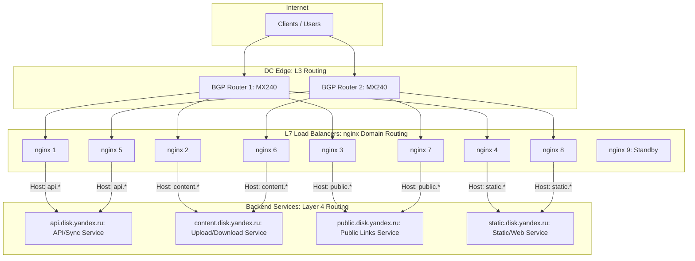
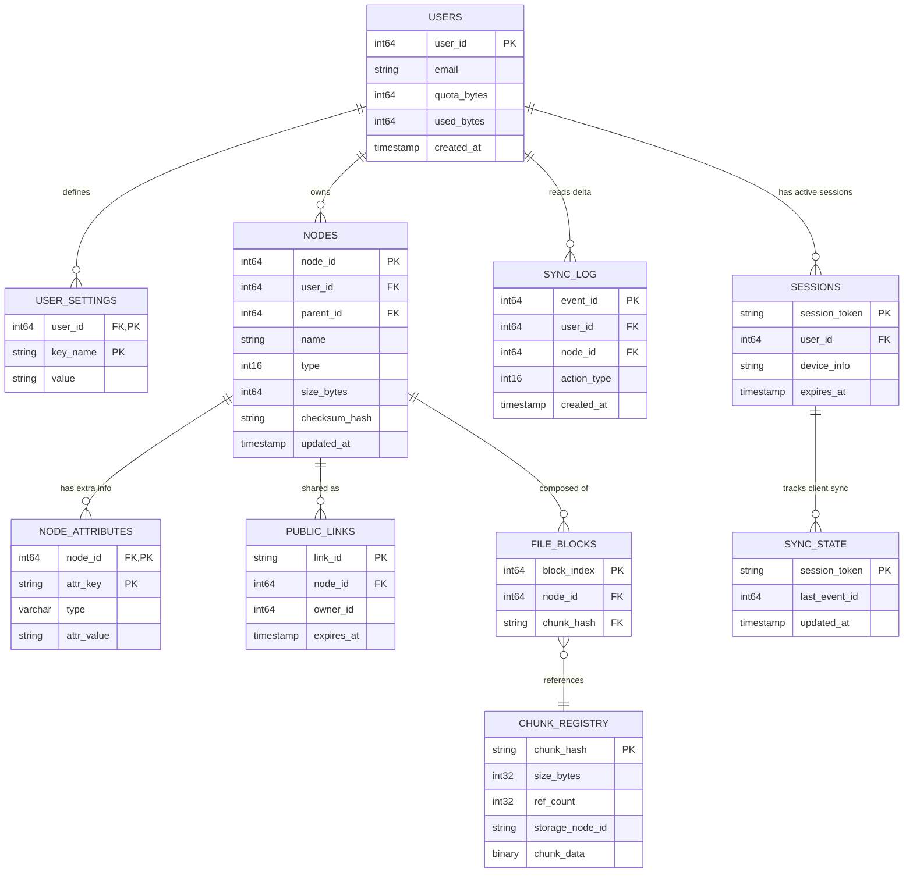
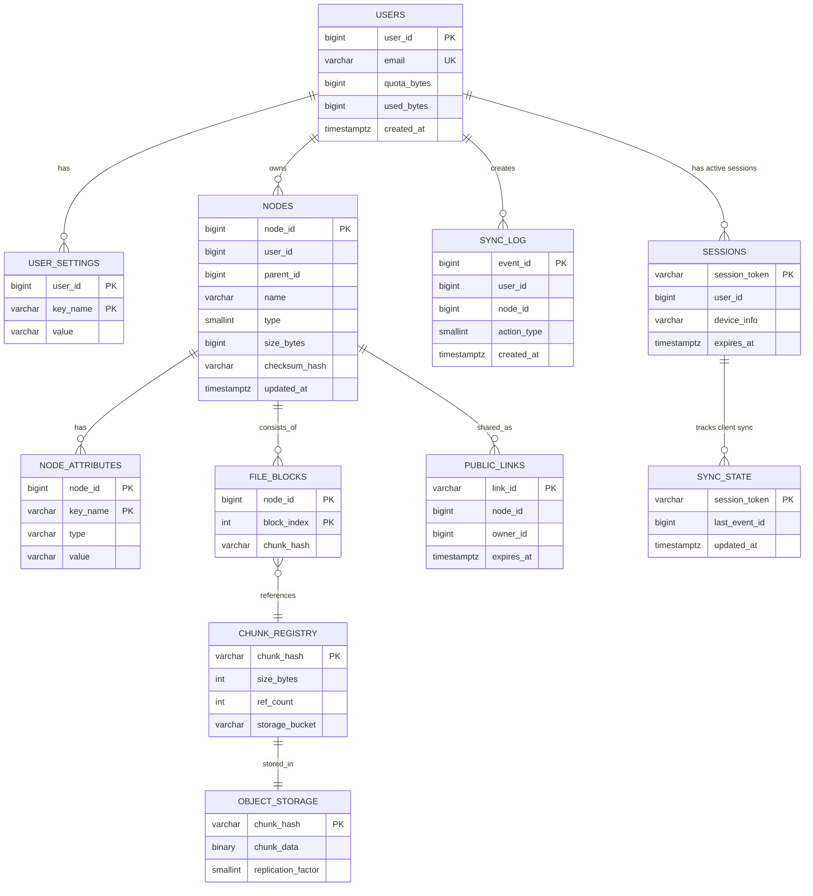
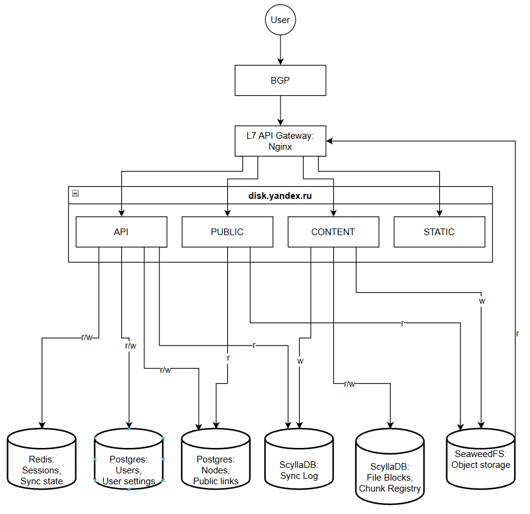

# Яндекс Диск

## 1. Тема, целевая аудитория и функционал

### 1.1 Тема и целевая аудитория

**Яндекс.Диск** - облачное файловое хранилище, входящее в экосистему Яндекс 360. Сервис ориентирован на доступность, скорость и простоту использования.

**Активность (оценка):**
*   **Месячная активная аудитория (MAU):** 93 млн пользователей. [2]
*   **Дневная активная аудитория (DAU):** ~9 млн пользователей.

**География:** Основной рынок - Россия и страны СНГ. Сервис также доступен в Турции, Израиле и других странах присутствия Яндекса. Распределение аудитории по странам можно оценить на основе общих данных Яндекса [3]:

| Страна | Количество пользователей, млн |
|--------|-------------------------------|
| Россия | 79 |
| Украина | 5 |
| Казахстан | 3 |
| Беларусь | 2 |
| Турция | 2 |

### 1.2 Функционал MVP

Для проектирования выбран минимальный набор функций, создающих основную нагрузку на систему, с учётом опыта развития API, описанного в [4]:
1.  **Загрузка файла** (upload) - сохранение файла в облако (включая автоматическую загрузку с мобильных устройств).
2.  **Скачивание файла** (download) - получение файла по запросу пользователя.
3.  **Просмотр списка файлов и папок** (list) - получение метаданных содержимого директории.
4.  **Создание папки** (mkdir) - создание новой директории.
5.  **Удаление файла/папки** (delete) - перемещение в корзину.
6.  **Получение публичной ссылки** (share) - создание ссылки для общего доступа.
7.  **Просмотр файла** (view) - посмотреть содержимое файла.
8.  **Операции с файлами** (copy/move) - асинхронные операции копирования и перемещения [4].

### 1.3 Ключевые продуктовые и технические решения

1.  **Дедупликация данных на стороне сервера** - Техническое решение, при котором файл, идентичный уже загруженному другим пользователем, физически сохраняется только один раз. Это позволяет колоссально экономить дисковое пространство и оптимизировать стоимость хранения для миллионов пользователей.
2.  **Дифференциальная синхронизация (блочная загрузка)** - При изменении большого файла (например, видеомонтажа) приложение загружает в облако не весь файл целиком, а только измененные блоки. Это критически ускоряет синхронизацию и снижает нагрузку на каналы связи пользователя и серверы.
3.  **Кэширование и "ленивая" загрузка контента для превью** - Для обеспечения быстрой и плавной работы галерей фото и видео на всех устройствах используется интеллектуальная система создания и кэширования превью (миниатюр) разного размера. Полная версия файла загружается только по запросу пользователя, что экономит трафик и ускоряет интерфейс.

## 2. Расчёт нагрузки

### 2.1 Продуктовые метрики

| Метрика | Значение | Обоснование / Источник |
| :--- | :--- | :--- |
| **Monthly Active Users (MAU)** | **93 млн** | Официальные данные Яндекса [2] |
| **Daily Active Users (DAU)** | **9 млн** | Принято для проектирования (~10% от MAU что примерно соответствует статистике Dropbox) |
| **Среднее количество файлов у пользователя** | **~1000** | Оценка на основе среднего объёма хранилища и среднего размера файла |
| **Средний размер файла** | **~10 МБ** | На основе исследования [5] |
| **Средний объём хранилища пользователя** | **10 ГБ** | [1]: близко к статистике гугл диска |
| **Количество загрузок в день (upload)** | **10** на пользователя | Из [6]: 500 млн загрузок на 50 млн пользователей = 10 файлов день |
| **Количество скачиваний в день (download)** | **24** на пользователя | [6]: Файлы читают в 2.4 раз чаще чем пишут |
| **Количество запросов синхронизации (sync)** | **332** на пользователя | Синхронизация каждые 30 сек. при работе приложения в среднем 2 ч/д и каждые 30 мин при отключенном в среднем на 2 устройствах 2 * 60 * 2 + 2 * 2 * 24 - 2 * 2 = 332 |
| **Количество просмотров списка (list)** | **50** на пользователя | соответствует количеству просмотренных (переходы + пагинация) |
| **Количество созданий публичных ссылок (share)** | **2** на пользователя | редкое действие |
| **Количество удалений (delete)** | **2** на пользователя | редкое действие |
| **Количество перемещений (move)** | **2** на пользователя | редкое действие |

### 2.2 Технические метрики

#### Расчёт объёма хранения (на основе MAU)

| Тип данных | Средний объём на пользователя | Общий объём на 93 млн пользователей |
| :--- | :--- | :--- |
| Файлы пользователей | 10 ГБ | **930 ПБ** |
| Метаданные и служебные копии | ~0,1 ГБ | **~9,3 ПБ** |
| **Итого** | **~10,1 ГБ** | **~939,3 ПБ** |

#### Сетевой трафик (на основе DAU = 9 млн)

Средний размер запроса/ответа для операций с метаданными (sync, list, share, delete, move) принят равным **1 КБ**. Для upload/download – **5 МБ**.

| Тип трафика                  | Суточный объём (ГБ/сут)               | Средний трафик (Гбит/с)             | Пиковый трафик (k=2) (Гбит/с) |
| :--------------------------- | :------------------------------------ | :---------------------------------- | :---------------------------- |
| **Входящий (upload)**        | 9 млн × 10 × 10 МБ = **900 000 ГБ**   | 900 000 × 8 / 86 400 = **83,33**    | **~167**                     |
| **Исходящий (download)**     | 9 млн × 24 × 10 МБ = **2 160 000 ГБ** | 2 160 000 × 8 / 86 400 = **200** | **~400**                    |
| **Синхронизация (sync)**     | 9 млн × 332 × 1 КБ = **2 988 ГБ** | 2 988 × 8 / 86 400 = **0,277**      | **0,554**                     |
| **Просмотр списка (list)**   | 9 млн × 50 × 1 КБ = **450 ГБ**    | 450 × 8 / 86 400 = **0,0417**       | **0,0833**                    |
| **Публичная ссылка (share)** | 9 млн × 2 × 1 КБ = **18 ГБ**      | 18 × 8 / 86 400 = **0,00167**       | **0,00333**                   |
| **Удаление (delete)**        | 9 млн × 2 × 1 КБ = **18 ГБ**      | 18 × 8 / 86 400 = **0,00167**       | **0,00333**                   |
| **Перемещение (move)**       | 9 млн × 2 × 1 КБ = **18 ГБ**      | 18 × 8 / 86 400 = **0,00167**       | **0,00333**                   |
| **Итого (суммарно)**         | **5403492 ГБ/сут**                  | **~284 Гбит/с**                   | **~568 Гбит/с**             |

Для входящих данных нагрузка в пике может возрастать в 2-10 раз (Увеличивается как размер так и количество файлов). Возьмем для них k = 2

#### Расчёт RPS (на основе DAU = 9 млн)

Коэффициент пиковой нагрузки *k* = 2.

| Тип запроса                 | Доля запросов | Средний RPS | Пиковый RPS |
| :-------------------------- | :------------ | :---------- | :---------- |
| Синхронизация (sync)        | 74,1%         | **34 560**  | **69 180**  |
| Скачивание файла (download) | 11,2%         | **5 227**   | **10 454**  |
| Просмотр списка (list)      | 11,2%         | **2 509**   | **5 018**  |
| Загрузка файла (upload)     | 2,23%         | **1 040**   | **2 080**   |
| Публичная ссылка (share)    | 0,45%         | **208**     | **416**     |
| Удаление (delete)           | 0,45%         | **208**     | **416**     |
| Перемещение (move)          | 0,45%         | **208**     | **416**     |
| **Итого**                   | **100%**      | **43 949**  | **87 898**  |

Для входящих данных нагрузка в пике может возрастать в 2-10 раз (Увеличивается как размер так и количество файлов). Возьмем для них k = 4

## 3. Глобальная балансировка нагрузки

### 3.1 Функциональное разбиение по доменам

Для оптимизации обработки разнородных запросов и независимого масштабирования сервисов используются следующие домены:

| Доменное имя | Назначение |
| --- | --- |
| **`api.disk.yandex.ru`** | Основное API (метаданные, управление файлами, синхронизация) |
| **`content.disk.yandex.ru`** | Передача "тяжёлого" контента (загрузка и скачивание файлов) |
| **`public.disk.yandex.ru`** | Раздача файлов по публичным ссылкам |
| **`static.disk.yandex.ru`** | Статические ресурсы (веб-интерфейс, клиентские скрипты) |

### 3.2 Расположение дата-центров

Для обеспечения низкой задержки и соответствия требованиям законодательства о персональных данных используются дата-центры на территории России и один зарубежный узел.

| ID | Локация (город, страна) | Обслуживаемый регион |
| --- | --- | --- |
| **DC1** | **Москва (Россия)** | Европейская часть России, ближнее зарубежье |

**Обоснование выбора:**

* **Москва** – крупнейший транспортный узел, минимальные задержки для большинства российских пользователей. Иностранцев не так много.

## 4. Локальная балансировка нагрузки

### 4.1 Схема балансировки

**BGP-балансировка**

| Параметр     | Значение        | Обоснование  |
| :----------- | :-------------- | :------ |
| **Количество**  | 2   | Один основной, один резервный (N + 1)    |
| **Модель / Комплектующие**             | Cisco ASR 9000 / Juniper MX, 100GbE | Высокопроизводительные маршрутизаторы для DC                                                                                        |
| **Поддержка одновременных BGP-сессий** | до 50 000                           | Источник: [10] |
| **Пропускная способность**             | >100 Гбит/с                         | Современные маршрутизаторы поддерживают полный ECMP трафик DC                                                                       |
| **Отказоустойчивость**                 | VRRP + ECMP                         | Переключение VIP на резерв при падении основного    |

**L7-балансировщик (прикладной уровень)**

| Параметр           | Описание  |
| :----------------- | :------ |
| **Реализация**     | Кластер серверов nginx (Reverse Proxy)                                                   |
| **Функции**        | SSL Termination, маршрутизация HTTP-запросов, распределение нагрузки по backend-сервисам |
| **Оптимизация**    | Session tickets для ускорения повторных TLS-соединений                                   |
| **Резервирование** | Схема **N + 1** |

### 4.2 Расчёт количества балансировщиков

Расчёт выполнен для наиболее загруженного дата-центра (**DC1 — Москва**) в «худшем» случае.

**Исходные параметры (до учёта CDN):**
- Пиковый трафик: **~567 Гбит/с**
- Пиковая нагрузка: **87 898 RPS**

#### 2. Расчёт узлов L7

Конфигурация узла L7:
- CPU: **16 cores**
- NIC: **100GbE**

Учитываются два ограничителя: пропускная способность сети и производительность SSL-рукопожатий (TPS).

**По пропускной способности:**

567 Гбит/с ÷ 71 Гбит/с = 7,99 -> 8 серверов

**По SSL Termination (TPS):**
Интенсивность новых TLS-соединений в пике принимается равной **50% от общего RPS** (консервативная оценка):

CPS = 87 898 RPS × 0,5 = 43 949 соединений/с

Согласно тестам производительности nginx, один экземпляр на 16 ядрах способен обработать до **6 676 TLS-рукопожатий в секунду**.

Необходимое количество активных L7 узлов = 46 949 ÷ 6 676 ≈ 6,58 → 7 сервера

**Выбор ограничителя:**

| Ограничение | Требуемое количество серверов |
| :--- | :--- |
| Пропускная способность сети | 8 |
| SSL Termination | 7 |

Выбирается «худший» случай — **8 серверов**.

С учётом резервирования по схеме **N + 1**:

Итого L7 серверов = 7 + 1 = 8 серверов

### 4.3 Итоговая конфигурация оборудования для московского ДЦ (DC1)

| Уровень         | Количество | Комплектующие                       | Тип резервирования |
| :-------------- | :--------- | :------------ | :----------------- |
| **BGP routers** | 2          | MX240 | N + 1              |
| **L7 (nginx)**  | 9          | [8] | N + 1  |

### 4.5 Архитектурная схема балансировки

### Пояснения к схеме:

1.  **L3 (BGP Edge):** Два маршрутизатора работают в паре. Использование **ECMP (Equal-Cost Multi-Pathing)** позволяет равномерно распределять входящий пакетный поток между всеми активными узлами L4-кластера.
2.  **L4 (LVS Direct Routing):** 
    *   Балансировщики LVS не анализируют HTTP-заголовки, они работают только с IP/Портами. 
    *   В режиме **Direct Routing** LVS меняет только MAC-адрес получателя в кадре и пересылает его на один из Nginx-узлов. 
    *   **Критически важно:** Узлы Nginx имеют тот же VIP на своем loopback-интерфейсе, что позволяет им принимать пакеты и отвечать клиенту **напрямую**, минуя L4-балансировщик на обратном пути. Это позволяет вашей системе выдавать 567 Гбит/с трафика, не перегружая LVS-ноды.
3.  **L7 (Nginx):** Выполняет самую ресурсоемкую задачу — **SSL Termination** (расшифровка трафика). После расшифровки Nginx анализирует URL (например, `api.disk...` или `content.disk...`) и проксирует запрос на соответствующий бэкенд.
4.  **Резервирование:** 
    *   На уровне L4 используется схема **N+1** (9 серверов: 8 активных покрывают 567 Гбит/с, 1 в горячем резерве).
    *   На уровне L7 также **N+1** (9 серверов: 8 активных покрывают пик по CPS/RPS, 1 в резерве).
5.  **Data Path:** Тяжелые данные (файлы) хранятся в SeaweedFS. При скачивании файл проходит через Nginx (для шифрования), но «пролетает» мимо LVS на выход в интернет, что обеспечивает линейную масштабируемость системы.

## 5. Логическая схема БД

### 5.1. Логическая схема данных (ER-диаграмма)

### 5.2. Описание таблиц и нагрузок

| Таблица             | Описание                         | Объем (строк) | Размер данных | QPS (Read/Write) | Консистентность |
| :------------------ | :------------------------------- | :------------ | :------------ | :--------------- | :-------------- |
| **Users**           | Аккаунты и квоты                 | 93 млн        | ~15 ГБ        | 10k / 2k         | Strong          |
| **Nodes**           | Дерево файлов и папок            | 100 млрд      | ~15 ТБ        | 60k / 15k        | Strong          |
| **Node_Attributes** | Доп. метаданные                  | 300 млрд      | ~20 ТБ        | 40k / 10k        | Strong          |
| **File_Blocks**     | Маппинг файлов на чанки          | 200 млрд      | ~18 ТБ        | 20k / 15k        | Eventual        |
| **Chunk_Registry**  | Реестр дедупликации              | 50 млрд       | ~939,3 ПБ          | 10k / 5k         | Eventual        |
| **Sync_Log**        | История изменений                | 10 млрд       | ~3 ТБ         | 40k / 20k        | Strong          |
| **Public_Links**    | Публичные ссылки                 | 500 млн       | ~80 ГБ        | 10k / 500        | Eventual        |
| **Sessions**        | Активные пользовательские сессии | ~30 млн       | ~5 ГБ         | 50k / 20k        | Eventual        |
| **Sync_State**      | Состояние синхронизации клиента  | ~30 млн       | ~3 ГБ         | 40k / 20k        | Eventual        |

*\* Оценка: в среднем 3 доп. атрибута на файл (mimetype, width, height).*
*\** Оценка: средний файл разбит на 2 блока по 5 МБ.*

### 5.3. Требования к консистентности

#### 1. Строгая консистентность (Strong Consistency)

Используется для критичных метаданных:

**Nodes + Node_Attributes + Sync_Log**

Причина:

* операции **rename / move / delete** должны быть атомарными
* клиенты синхронизации должны получать корректную последовательность изменений

Также строгая консистентность требуется для:

**Users**

чтобы предотвратить:

* превышение квоты
* гонки при одновременных загрузках

#### 2. Eventual Consistency

Используется для данных, где допустима задержка обновления:

**Chunk_Registry**

* обновление `ref_count`
* асинхронная очистка неиспользуемых чанков

**Public_Links**

* распространение информации о новой ссылке может занимать сотни миллисекунд

**sessions**

* кратковременная рассинхронизация лишь немного продлевает жизнь токена

**chunk_registry**

* ошибки ref_count не приводят к потере данных, только к задержке очистки

## 6. Физическая схема БД

### Денормализация

1. В `nodes` хранится `size_bytes`, чтобы быстро отображать размер файлов и папок без агрегации по `file_blocks`.
2. В `users` хранится `used_bytes`, чтобы проверять квоту пользователя без пересчёта размера всех файлов.
3. В `nodes` хранится `checksum_hash`, чтобы ускорить дедупликацию и не обращаться к `chunk_registry` при каждой операции.
4. Содержимое файлов вынесено из БД в **объектное хранилище**, а в `chunk_registry` хранится только ссылка на физическое размещение блока.
5. В `nodes` хранится `type` (file/folder), чтобы не вычислять тип по наличию дочерних элементов.
6. В `NODE_ATTRIBUTES` добавлен тип для упрощения маппинга.

### 6.1 Выбор СУБД

| Таблица | СУБД / хранилище      | Обоснование |
| ----- | ---- | --- |
| `users`, `user_settings`, `nodes`, `public_links` | **PostgreSQL**        | транзакции и ACID |
| `file_blocks` | **ScyllaDB**          | большой объём записей |
| `chunk_registry` | **ScyllaDB**          | глобальный индекс дедупликации |
| `sync_log` | **ScyllaDB**          | append-only журнал |
| `sessions`, `sync_state` | **Redis**             | быстрый доступ и TTL  |
| `object_storage`| **SeaweedFS** | эффективное хранение мелких и крупных файлов, высокая скорость доступа, встроенная поддержка репликации и тиринга |

### 6.2 Индексы

| Таблица          | Поле                     | Тип индекса                | Обоснование                                         |
| :--------------- | :----------------------- | :------------------------- | :-------------------------------------------------- |
| `users`          | `user_id`                | B-Tree                     | быстрый доступ к профилю пользователя               |
| `users`          | `email`                  | B-Tree (unique)            | используется при авторизации                        |
| `nodes`          | `node_id`                | B-Tree                     | прямой доступ к файлу или папке                     |
| `nodes`          | `(user_id, parent_id)`   | Composite B-Tree           | получение списка файлов внутри папки                |
| `nodes`          | `(user_id, updated_at)`  | B-Tree                     | используется при синхронизации клиента              |
| `file_blocks`    | `(node_id, block_index)` | Partition key + clustering | позволяет получать блоки файла в правильном порядке |
| `chunk_registry` | `chunk_hash`             | Partition key              | быстрый поиск блока для дедупликации                |
| `sync_log`       | `(user_id, event_id)`    | Partition key + clustering | получение новых событий при синхронизации           |
| `public_links`   | `link_id`                | B-Tree                     | доступ к файлу по публичной ссылке                  |
| `public_links`   | `node_id`                | B-Tree                     | поиск всех ссылок для конкретного файла             |

### 6.3 Шардирование и резервирование СУБД

**Шардирование**

| Таблица                    | СУБД       | Ключ шардирования            | Обоснование                                                                                                     |
| :------------------------- | :--------- | :--------------------------- | :-------------------------------------------------------------------------------------------------------------- |
| `users`                    | PostgreSQL | `user_id`                    | Равномерное распределение пользователей между узлами                                                            |
| `nodes`, `node_attributes` | PostgreSQL | `user_id`                    | Все файлы пользователя находятся на одном шарде, что позволяет выполнять операции без распределённых транзакций |
| `user_settings`            | PostgreSQL | `user_id`                    | Настройки пользователя логически связаны с его аккаунтом                                                        |
| `public_links`             | PostgreSQL | `link_id`                    | Равномерное распределение публичных ссылок                                                                      |
| `file_blocks`              | ScyllaDB   | `node_id` (Partition Key)    | Все блоки одного файла хранятся на одном узле                                                                   |
| `chunk_registry`           | ScyllaDB   | `chunk_hash` (Partition Key) | Равномерное распределение чанков и быстрый поиск при дедупликации                                               |
| `sync_log`                 | ScyllaDB   | `user_id` (Partition Key)    | Все события пользователя хранятся вместе для быстрой синхронизации                                              |
| `sessions`, `sync_state`   | Redis      | `session_token`              | Быстрый доступ к данным сессии и состоянию синхронизации                                                        |
| `object_storage`           | SeaweedFS      | `hash_prefix`                | Равномерное распределение объектов по bucket-префиксам                                                          |

**Резервирование**

| СУБД       | Схема | Обоснование |
| :--------- | :--- | :---- |
| PostgreSQL | Master–Replica (1 мастер, 2 реплики). Запись на мастер, чтение с реплик. Автоматический failover через Patroni | Исключение единой точки отказа внутри дата-центра и распределение нагрузки чтения |
| ScyllaDB   | Каждая партиция хранится на 3 узлах (Replication Factor = 3). Консистенция QUORUM                              | Автоматическое восстановление данных при отказе узла                              |
| Redis      | Redis Cluster (мастер + реплика на каждый слот). Автоматический failover                                       | Отказоустойчивость хранения сессий                                                |
| SeaweedFS      | Erasure Coding внутри кластера                                                                                 | Защита данных при отказе дисков или серверов                                      |

### 6.4 Клиентские библиотеки и интеграции

| СУБД       | Примеры для Go        |
| :--------- | :-------------------- |
| PostgreSQL | Библиотека `pgx`      |
| ScyllaDB   | Библиотека `gocqlx`   |
| Redis      | Библиотека `go-redis` |
| SeaweedFS      | Библиотека `goseaweedfs` |

### 6.5 Балансировка запросов и мультиплексирование подключений

| СУБД       | Механизм    | Как работает |
| :--------- | :------ | :-------- |
| PostgreSQL | PgBouncer (пул соединений)          | PgBouncer поддерживает пул постоянных соединений к PostgreSQL, снижая накладные расходы на создание соединений                                     |
| ScyllaDB   | Token-aware routing                 | Драйвер знает, на каком узле кластера находятся данные для конкретного ключа (`node_id`, `chunk_hash`) и отправляет запрос напрямую на нужный узел |
| Redis      | Smart Client                        | Клиент вычисляет слот Redis Cluster и обращается к нужному узлу                                                                                    |
| SeaweedFS      | Load balancing между storage-нодами | Объекты распределяются по нескольким storage-нодам кластера, что позволяет равномерно распределять нагрузку                                        |

## 6.6 Схема резервного копирования

| Хранилище  | Что бэкапим   | Как бэкапим  | Зачем |
| :--------- | :-------- | :----- | :------- |
| PostgreSQL | Пользователи, структура файлов              | Ежедневный полный бэкап + архивация WAL        | Возможность восстановления базы на любой момент времени |
| ScyllaDB   | `file_blocks`, `chunk_registry`, `sync_log` | Периодические snapshot-бэкапы (Scylla Manager) | Быстрое восстановление данных                           |
| Redis      | Сессии и состояние синхронизации            | AOF + периодические RDB snapshot               | Минимизация потерь данных                               |
| SeaweedFS      | Блоки файлов пользователей                  | Versioning + периодические snapshot-бэкапы     | Восстановление удалённых или повреждённых объектов      |

# 7. Описание алгоритмов функционирования блоков системы

## 7.1 Алгоритм дедупликации файлов

**Блок / подсистема:** `Chunk Registry` и `File Blocks`

**Постановка задачи:**
Обеспечить хранение уникальных блоков файлов для уменьшения занимаемого дискового пространства и ускорения передачи данных при синхронизации.

**Исходные данные, ограничения и требования:**

* Исходные данные: бинарные блоки файлов (chunks), размер ~5 МБ каждый.
* Ограничения: высокая скорость записи и чтения блоков, миллионы операций в секунду (QPS).
* Требования к результату: гарантированное отсутствие дубликатов, быстрый доступ по хешу блока, минимизация блокировок при параллельной записи.

**Последовательность работы алгоритма:**

1. Получение нового блока файла от пользователя.
2. Вычисление хеша блока (`chunk_hash`).
3. Проверка существования хеша в `Chunk Registry`:
   * Если существует — увеличивается счетчик `ref_count`.
   * Если не существует — создается новая запись и блок сохраняется в объектное хранилище (S3).
4. Создание записи в `File Blocks`, связывающей файл с блоком.

**Используемые структуры данных:**

* Хеш-таблица (`chunk_hash` → метаданные блока).
* Счетчик ссылок `ref_count` для управления удалением блоков.
* Очереди или батчи для асинхронной записи в объектное хранилище.

**Рассматриваемые альтернативы:**

* Полное хранение всех блоков без дедупликации → высокая нагрузка на хранение и сеть.
* Использование отдельной БД для метаданных блоков с жесткой консистентностью → ухудшение QPS при массовой загрузке.

**Обоснование выбора:**

* Eventual Consistency достаточна для `Chunk Registry`, так как небольшая задержка обновления `ref_count` допустима.
* Хеширование обеспечивает уникальность блоков и минимизирует вычислительные затраты.
* Асинхронная запись в S3 снижает нагрузку на СУБД и ускоряет клиентскую синхронизацию.

**Влияние на физическую схему и нагрузку:**

* Таблица `Chunk Registry` шардирована по `chunk_hash`.
* Массив блоков хранится в S3, что требует высокой пропускной способности каналов между сервисами и объектным хранилищем.
* Высокий QPS на чтение/запись определяет необходимость горизонтального масштабирования ScyllaDB.

## 8. Технологии
| Технология  | Область применения  | Мотивационная часть  |
| :---- | :----- | :------- |
| **PostgreSQL** | Хранение метаданных пользователей, дерева файлов и публичных ссылок (`users`, `nodes`, `user_settings`, `public_links`) | Полная поддержка транзакций ACID, строгая консистентность данных, развитая система индексов и возможность выполнения сложных запросов  |
| **ScyllaDB** | Хранение больших объёмов данных (`file_blocks`, `chunk_registry`, `sync_log`)   | Высокая производительность при миллионах операций в секунду, горизонтальное масштабирование, оптимизация под большие объёмы данных и распределённые системы |
| **Redis** | Кэширование сессий и состояния синхронизации (`sessions`, `sync_state`), кэш популярных ссылок  | Очень низкая задержка доступа к данным, поддержка TTL для автоматического удаления устаревших данных, снижение нагрузки на основную СУБД   |
| **SeaweedFS** | Распределенное объектное хранилище | **Архитектура Haystack:** предотвращает перегрузку файловой системы (inode exhaustion) за счет упаковки чанков в большие volume-файлы. Минимальные задержки при чтении (1 disk seek на файл). Встроенное шардирование и легкое масштабирование до экзобайтов. |
| **LVS**  | L4 балансировка сетевого трафика | Высокая производительность при обработке сетевых пакетов, минимальная задержка, возможность распределения нагрузки на уровне TCP/UDP  |
| **Nginx** | L7 балансировка HTTP/HTTPS, SSL termination | Высокая производительность обработки HTTP-запросов, гибкая маршрутизация, эффективная работа с TLS-соединениями |
| **BGP** | Маршрутизация трафика между граничными узлами дата-центра  | Позволяет равномерно распределять сетевой трафик между маршрутизаторами и обеспечивает отказоустойчивость сети |
| **Docker**  | Контейнеризация сервисов системы | Упрощает развёртывание и изоляцию сервисов, обеспечивает переносимость между средами  |
| **Kubernetes**  | Оркестрация контейнеров и управление инфраструктурой сервисов  | Автоматическое масштабирование, балансировка нагрузки между контейнерами, управление жизненным циклом сервисов  |
| **Linux (Ubuntu Server)** | Операционная система серверов инфраструктуры | Высокая стабильность, широкая поддержка сетевых и серверных технологий, оптимизация для работы в дата-центрах |
| **gocqlx**   | Клиент ScyllaDB для Go | Эффективная работа с распределённой базой данных и поддержка token-aware routing      |
| **pgx**  | Клиент PostgreSQL для Go   | Высокопроизводительная работа с PostgreSQL, поддержка пула соединений и транзакций                                                                          |
| **go-redis**   | Клиент Redis для Go   | Быстрый доступ к Redis, поддержка Redis Cluster    |
| **goseaweedfs**  | Клиент для работы с объектным хранилищем SeaweedFS   | Обеспечивает высокопроизводительный доступ к нативному API SeaweedFS; поддерживает автоматическое разбиение больших файлов на чанки (chunking), механизм Lookup для поиска Volume-серверов и кэширование их расположения».  |

## 9. Схема проекта

Пояснения к схеме:
* r - read, w - write

## 10. Обеспечение надёжности

### 10.1 Сводная таблица методов резервирования

| Компонент системы | Метод обеспечения надёжности |
| :--- | :--- |
| **Гео-резервирование** | **Резервирование ДЦ:** Распределение нагрузки между независимыми дата-центрами через GeoDNS. При отказе региона трафик переключается на ближайший доступный узел. |
| **BGP Маршрутизаторы** | **Failover policy:** Резервирование по схеме **N + 1**. Использование протокола BGP и механизмов ECMP для мгновенного исключения отказавшего узла из маршрутизации. |
| **Nginx (L7)** | **Сегментирование (Кластеризация API):** Разделение трафика по доменам (`api`, `content`, `public`). Проблемы или перегрузки в «тяжелом» сервисе контента не аффектят работу критически важного API синхронизации. |
| **PostgreSQL** | **Репликация данных:** Схема Master-Replica с автоматическим failover через **Patroni**. Архивация WAL-логов для возможности восстановления данных на любой момент времени (PITR). |
| **ScyllaDB** | **Асинхронные паттерны (Event-driven):** Использование лога событий (`Sync Log`) позволяет восстановить состояние клиента после офлайна. Распределенное хранение с фактором репликации **RF=3**. |
| **SeaweedFS** | **Резервирование компонентов:** Использование **Erasure Coding** для защиты от выхода из строя физических дисков. Резервирование Master-нод через Raft-консенсус (минимум 3 узла). |
| **Микросервисы (Go)** | **Автоматический Failover:** Оркестрация через **Kubernetes**. Использование Readiness и Liveness проб для автоматического перезапуска и исключения неисправных инстансов из балансировки. |

### 10.2 Graceful Shutdown
При обновлении или плановой остановке сервисов (особенно `API` и `Content Service`) реализован механизм «плавной» остановки:
1.  Сервис перестает принимать новые входящие запросы от Nginx.
2.  Дожидается завершения текущих активных сессий (особенно важно для загрузки чанков в SeaweedFS).
3.  Завершает текущие транзакции в PostgreSQL и записи в ScyllaDB.
4.  Только после этого завершает процесс. Это минимизирует фон 500-х ошибок на графиках при релизах.

### 10.3 Graceful Degradation (Деградация функциональности)
Архитектура учитывает вероятность частичных отказов компонентов:
*   **Отказ хранилища:** При сбое в SeaweedFS пользователи сохраняют доступ к интерфейсу и спискам файлов (из БД), но не могут скачивать/загружать контент. Приоритет отдается чтению метаданных.
*   **Отказ лога событий:** Если ScyllaDB перегружена, система может временно увеличить интервал синхронизации (Sync Polling) для клиентов, снижая нагрузку на запись, но сохраняя возможность ручного управления файлами.
*   **Circuit Breaker:** На уровне Nginx и API-сервисов применяются «предохранители» — если один из шардов базы данных отвечает медленно, запросы к нему временно блокируются, чтобы не занимать рабочие потоки (workers) и не вызывать каскадное падение всей системы.

### 10.4 Observability (Мониторинг и логирование)
Для обеспечения прозрачности работы системы используются:
*   **Мониторинг (Prometheus/Grafana):** Сбор системных метрик (CPU, RAM, IOPS) и пользовательских показателей (RPS, Latency, Error Rate). Особое внимание уделяется анализу **квантилей** (P99), чтобы выявлять проблемы в хвосте длинных запросов.
*   **Логирование (ELK Stack):** Сбор структурированных логов (`access`, `error`, `work`). Применение **Request ID** (Trace ID) для сквозной трассировки запроса через все слои: от Nginx до конкретного шарда базы данных.
*   **Алертинг:** Настройка уведомлений на критические отклонения (рост 5xx ошибок, исчерпание квот в ДЦ, лаг репликации БД), позволяющая дежурной смене реагировать до того, как проблема станет массовой.

---

## Список источников

1.  [OneDrive vs Google Drive in 2025: Which Cloud Storage is Best for Your Needs?](https://www.marketingscoop.com/marketing/onedrive-vs-google-drive-in-2023-which-cloud-storage-is-best-for-your-needs)
2.  [Презентация о компании МКПАО «ЯНДЕКС» (3К 2025)](https://yastatic.net/s3/ir-docs/docs/2025/q3/25b90c11d0060d861ec0957dbbb96eeb/3Q25_Supplementary_slides_RUS_bbb9.pdf)
3.  [Маркетинговый годовой отчет за 2024 год](https://yastatic.net/s3/ir-docs/prospectus/reports/2024/RUS_YANDEX_AR2024.pdf)
4.  [Клеба В. «От десятков до сотен тысяч RPS: как мы создали API, который развивается 10 лет без дропа обратной совместимости» - Habr, 2024.](https://habr.com/ru/companies/yandex/articles/839198/)
5.  [How Big Are Peoples' Computer Files? File Size Distributions Among User-managed Collections](https://arxiv.org/abs/2107.03272)
6. [Inside Dropbox: Understanding Personal Cloud Storage Services](https://www.researchgate.net/publication/240918599_Inside_Dropbox_Understanding_personal_cloud_storage_services)
7. [Request rate and access distribution guidelines](https://docs.cloud.google.com/storage/docs/request-rate?utm_source=chatgpt.com)
8. [Testing the Performance of NGINX and NGINX Plus Web Servers](https://blog.nginx.org/blog/testing-the-performance-of-nginx-and-nginx-plus-web-servers?utm_source=chatgpt.com)
9. [Performance Benchmarks for global CDN performance backed by real-world data](https://umatechnology.org/performance-benchmarks-for-global-cdn-performance-backed-by-real-world-data/?utm_source=chatgpt.com)
10. [Juniper BGP Overview](https://www.juniper.net/documentation/us/en/software/junos/bgp/topics/topic-map/bgp-overview.html)